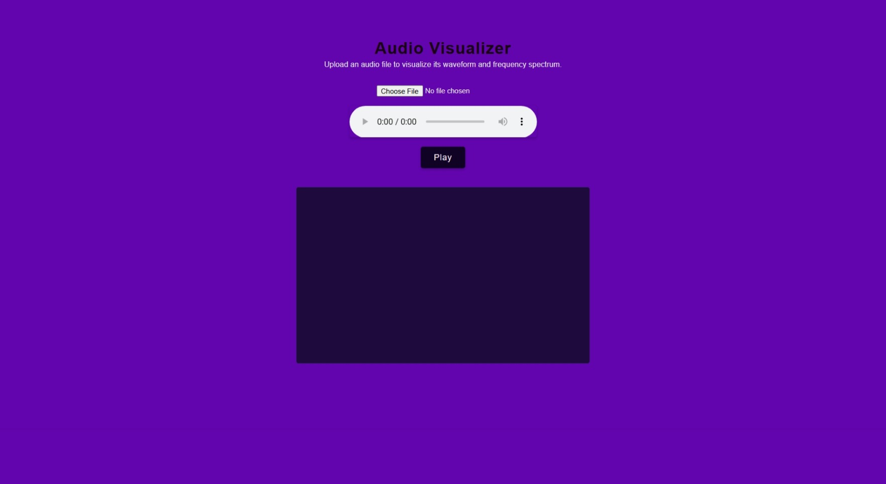

# Audio Visualizer
A website where you can upload audio and watch the colourful frequencies

## ScreenShot

## Try It
[Demo Link](https://temi-ay.github.io/Audio-visualizer/)

To try just open the link and try it

## Features
Allows you to upload any audio of your choice.

A Play button and a pause button.

A Canvas that displays colourful frequency bars.

## How it works
 __HTML__ for the Structure
 
 __CSS__ for the styling
 
 __JavaScript__ for the functionality
